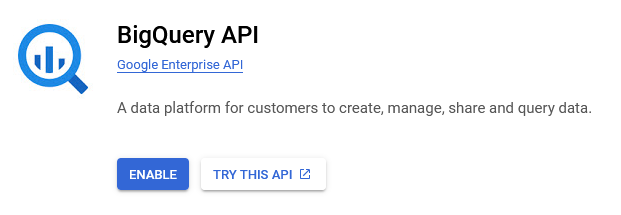

# Getting OEPS Data from BigQuery

Opioid Environment Policy Scan data is available on Google BigQuery. In this notebook, we'll go over how to interact with the data using `bigrquery`. We go over two of the `bigrquery` APIs -- one for readers familiar with SQL, and one for readers who want to avoid SQL. Lastly, readers who are already familiar with Google BigQuery will likely want to skip to [Make a Query](#querying).

```{r, include = FALSE}
knitr::opts_chunk$set(
  collapse = TRUE,
  comment = "#>",
  eval = TRUE
)
```

## Setting up BigQuery

When making queries against a BigQuery dataset, we do not directly query the dataset. Instead, we connect to a BigQuery profile and submit a job, which tells the profile to make the query in our stead and return the data. You can think of this like connecting to another computer to middleman the exchange.

```{r, echo=FALSE, fig.align='center'}
knitr::include_graphics('images/gc-structure.png')
```

The setup  allows users to work with multiple BigQuery datasets within a single profile, and also allows for billing to be separated so that data providers only pay to store the data instead of also paying for all usage of their data.

To enable BigQuery, sign into a Google account on your browser of choice before navigating to [this link](https://console.cloud.google.com/marketplace/product/google/bigquery.googleapis.com?hl=en&returnUrl=%252Fbigquery), where you will be prompted to "Enable BigQuery." Do so to enable your account to access BigQuery and data through BigQuery.

```{r, echo=FALSE, fig.align='center', out.width=700, out.height=246}
#
```

Once BigQuery is enabled, you'll be taken to the BigQuery studio page. This page is a hub for BigQuery interaction on the cloud, and technically also a place from which you can test out SQL queries and manage connections to external databases. In the BigQuery diagram, it's the computer on the cloud that you submit jobs to. 

For our purposes, we're interested in the resources under the explorer. By default, Google creates a default resource by mashing together random words and numbers. You can proceed using this resource, or create a new, more memorably named resource through the "+ ADD" button at the top of the Explorer pane.

Whichever route you take, we need to store the name of your BigQuery project in a variable for use. As it's the project that gets billed for the queries, it's conventional to refer to this project as "billing."

```{r bigquery project name}
billing <- "oeps-tutorial" # replace this with your project name!
```

Lastly, we need to establish that we actually have permission to create jobs on the account we created. To do that, we can use `bigrquery::bq_auth()`, and then grant the Tidyverse API a few permissions on our Google Account. Note that this command will prompt you to open a new window in your browser.

```{r, eval=FALSE}
# Opens your browser to authenticate your account
bigrquery::bq_auth()
```

```{r show=FALSE, echo=FALSE}
bigrquery::bq_auth(path=Sys.getenv("BIGQUERY_OEPS_TUTORIAL_KEY"))
```

## Making Queries {#query}

Now that we've enabled BigQuery on our account, we can use it to query the OEPS data on BigQuery.

First, lets back up and look at the OEPS project at a broader level. Currently, the OEPS data warehouse on BigQuery is named `oeps-391119`, and is divided into two datasets: `tabular` and `spatial`. The `tabular` dataset consists of 16 tables of attribute data at the state, county, tract, and ZCTA scales from 1980 to 2020. The `spatial` dataset contains the 2010 TIGER/Line geometries for each of these scales. The primary key for the datasets are `HEROP_ID`. A full dataset schema can be found on the OEPS BigQuery reference [linked here](https://github.com/healthyregions/oeps/blob/23_update_explorer/docs/BQ-Reference.md).

```{r, echo=FALSE, fig.align='center', out.width=400, out.height=400}
knitr::include_graphics('images/oeps-structure.png')
```

bigrquery offers three interfaces for interacting with BigQuery, but we introduce two here: the low-level API that uses SQL, and a higher level method using dplyr. 

### The low-level API {#low-level}

The low-level API offers a series of methods that can be used to interact with [BigQuery's REST API](https://cloud.google.com/bigquery/docs/reference/rest). While bigrquery offers quite a few commands, it's usually sufficient to use two: `bq_project_query` and `bq_table_download`.

Using these commands, we can create and submit SQL queries to pull data tables from the OEPS data warehouse: 

```{r bigrquery, warning=FALSE, message=FALSE}
library(bigrquery)

# Our query
sql <- 'SELECT HEROP_ID, TotPop, PovP FROM oeps-391119.tabular.C_1990'

# Submit a job to grab the data
tb <- bq_project_query(billing, query=sql)
# Download the results of that query to our system
results <- bq_table_download(tb)

head(results)
```

We can also use more complex queries:

```{r}
sql <- '
    SELECT
      C_1990.HEROP_ID,
      (C_2000.PovP - C_1990.PovP) AS ChangeInPovP,
      (C_2000.TotPop - C_1990.TotPop) AS ChangeInPop
    FROM oeps-391119.tabular.C_1990 INNER JOIN oeps-391119.tabular.C_2000
      ON C_1990.HEROP_ID=C_2000.HEROP_ID
'

tb <- bq_project_query(billing, sql)
results <- bq_table_download(tb)

head(results)
```

If we want to plot this data, we need to query the `spatial` database. This is doable, but R interactive environments are not always a fan of the result, so we're forced to turn `results` into an sf object _before_ attempting to preview it. That is, for the following setup:

```{r bad query, message=FALSE}
library(sf)

sql <- 'SELECT HEROP_ID, geom FROM oeps-391119.spatial.counties2010'
tb <- bq_project_query(billing, sql)
```

this breaks:

```{r, eval=FALSE}
# bad
results <- bq_table_download(tb)
head(results) 
```

And this works:

```{r}
# This works
results <- bq_table_download(tb) |> 
  st_as_sf(wkt='geom', crs='EPSG:4326') # convert geom to sf
head(results)
```

#### A full low-level pipeline:

Putting this all together, we can create a quick map of how county level poverty changed from 1990 to 2000:

```{r, message=FALSE}
library(tmap)
tmap_mode('view')
```

```{r low-level povchange, fig.align='center'}
sql <- '
    SELECT
      C_1990.HEROP_ID,
      (C_2000.PovP - C_1990.PovP) AS ChangeInPovP,
      counties2010.name, counties2010.geom
    FROM oeps-391119.tabular.C_1990 INNER JOIN oeps-391119.tabular.C_2000
      ON C_1990.HEROP_ID=C_2000.HEROP_ID
    INNER JOIN oeps-391119.spatial.counties2010 
      ON C_1990.HEROP_ID=counties2010.HEROP_ID
'

tb <- bq_project_query(billing, sql)
results <- bq_table_download(tb) |> st_as_sf(wkt='geom', crs='EPSG:4326')

tm_shape(results) + 
  tm_fill('ChangeInPovP', 
          style='sd', 
          midpoint=0,
          title='Change in Poverty\n 1990 to 2000',
          palette='-RdYlBu')

```

### The dplyr API {#dplyr}

For users with less SQL familiarity, it's also possible to use dplyr to interact with BigQuery. We'll need the help of DBI, a library for interacting with databases in R.

```{r, warning=FALSE, message=FALSE}
# install.packages(DBI) # uncomment if needed
library(dplyr)
library(DBI)
library(bigrquery)
```

For this pipeline, we use DBI to connect to a given dataset (e.g. `tabular`), before picking a table within the dataset to interact with and then manipulate that table using dplyr. 

```{r}
# Connect to the tabular dataset
conn <- dbConnect(
  bigquery(),
  project = 'oeps-391119',
  dataset = 'tabular',
  billing = billing
)

# List off available tables
dbListTables(conn)
```

We can then pick a table from the above and interact with it using dplyr.

```{r}
C_1990 <- tbl(conn, 'C_1990')

C_1990 |> 
  select(HEROP_ID, TotPop, PovP) |>
  collect() |>
  head()
```

As with the low-level API, we can also do more complex tasks, albeit with a few more lines of code:

```{r}
C_1990 <- tbl(conn, 'C_1990') |>
  select(HEROP_ID, PovP1990=PovP, TotPop1990=TotPop) |>
  collect()
C_2000 <- tbl(conn, 'C_2000') |>
  select(HEROP_ID, PovP2000=PovP, TotPop2000=TotPop) |>
  collect()

changes <- merge(C_2000, C_1990, on='HEROP_ID') |>
  mutate(ChangeInPovP = PovP2000-PovP1990,
         ChangeInTotPop = TotPop2000-TotPop1990) |>
  select(HEROP_ID, ChangeInPovP, ChangeInTotPop) |>
  collect()

head(changes)
```

We can also interact with spatial data. This also requires the same hack as above: we cannot preview our results until _after_ converting them to an `sf` object, at least within interactive R environments.

In other words, with this connection to the `spatial` dataset:

```{r}
# Connect to the spatial dataset
spatial_conn <- dbConnect(
  bigquery(),
  project = 'oeps-391119',
  dataset = 'spatial',
  billing = billing
)
```

This breaks:

```{r eval=FALSE}
# breaks
counties2010 <- tbl(spatial_conn, 'counties2010') |> 
  collect()

head(counties2010)
```

and this works:

```{r}
# works
counties2010 <- tbl(spatial_conn, 'counties2010') |>
  collect() |>
  st_as_sf(wkt='geom', crs='EPSG:4326')

head(counties2010)
```

#### A full dplyr pipeline:

Putting all the pieces together, we can make our poverty map with the following code: 

```{r, fig.align='center'}

# Make database connections
spat_conn <- dbConnect(
  bigquery(),
  project = 'oeps-391119',
  dataset = 'spatial',
  billing = billing
)
tab_conn <- dbConnect(
  bigquery(),
  project = 'oeps-391119',
  dataset = 'tabular',
  billing = billing
)

# Grab tables
C_1990 <- tbl(tab_conn, "C_1990")
C_2000 <- tbl(tab_conn, "C_2000")
counties2010 <- tbl(spat_conn, "counties2010")

# Data wrangling
C_1990 <- C_1990 |>
  select(HEROP_ID, PovP1990=PovP) |>
  collect()
C_2000 <- C_2000 |>
  select(HEROP_ID, PovP2000=PovP) |>
  collect()

change_in_pov <- merge(C_2000, C_1990, on='HEROP_ID') |>
  mutate(ChangeInPovP=PovP2000-PovP1990) |>
  select(HEROP_ID, ChangeInPovP)

counties2010 <- counties2010 |> 
  collect() |> 
  st_as_sf(wkt='geom', crs='EPSG:4326')
  
change_in_pov <- merge(counties2010, change_in_pov, on='HEROP_ID')

tm_shape(results) + 
  tm_fill('ChangeInPovP', 
          style='sd', 
          midpoint=0,
          title='Change in Poverty\n1990 to 2000',
          palette='-RdYlBu')

```
